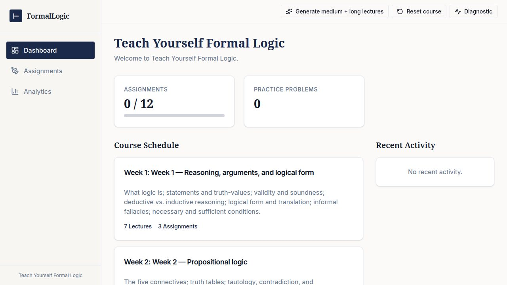

# ⊢ Teach Yourself Formal Logic

### Learn to reason like a logician — in four focused weeks.

*From "what makes an argument good?" to the proofs, quantifiers, and metatheorems behind every rigorous argument ever made.*

 

 

---

## Why this course

Most of us were never taught **how reasoning actually works** — only handed a few rules and told to trust them. Teach Yourself Formal Logic fixes that. It's a self-paced course that reveals the hidden *form* underneath every good argument, and teaches you to write that form down in symbols of your own.

By the end, you won't just recognize a valid argument — you'll be able to **prove** one, spot the flaw in a bad one, and understand exactly what a proof can and cannot guarantee.

 

## What you'll learn

A complete arc, building from everyday reasoning to the frontier of logic.

| Week | Theme | You'll master |
|:----:|:------|:--------------|
| **1** | Reasoning & arguments | Validity vs. soundness, deductive vs. inductive reasoning, logical form, and the everyday fallacies that fool almost everyone. |
| **2** | Propositional logic | Connectives, truth tables, equivalence and De Morgan's laws — and your first real proofs with natural deduction. |
| **3** | Predicate logic | Quantifiers, scope, identity, and how to translate "all," "some," and "the" into precise symbolic statements. |
| **4** | The big ideas | Soundness and completeness, modal logic, set theory, and the famous limits — what no proof procedure can ever decide. |

> Every lecture is grounded in a **real argument or landmark moment** — Aristotle's syllogistic, modus ponens, Russell's theory of descriptions, Gödel's theorems, and the undecidability of logic itself.

 

## How it works

A simple, proven loop you repeat in every lecture:

### 📖 Read the idea → 🔎 see it in a real argument → ✍️ write it yourself in symbols

Learn at the depth you want — a quick pass, a deeper read, or the full treatment — with a built-in tutor whenever you're stuck, practice that adapts to how you're doing, and instant, detailed feedback on everything you submit.

 

## What makes it different

- **✍️ You write, not just read** — every exercise asks you to express the key idea in real logical notation with an on-screen symbol keyboard, the way logicians actually work.
- **🎓 A tutor that knows where you are** — ask questions in plain language and get answers tied to the exact lecture you're on.
- **📈 Practice that meets you at your level** — difficulty adjusts as you go, so you're always challenged but never lost.
- **⚡ Real feedback, instantly** — homework, tests, a midterm, and a final, all graded with specific, actionable comments, not just a score.
- **🧵 One connected story** — not a pile of disconnected rules, but a single thread from your first argument to the limits of provability.

 

## Who it's for

- **Students** in philosophy, mathematics, or computer science who want logic to finally click.
- **Curious thinkers** who want to argue more clearly and see through bad reasoning.
- **Anyone** preparing for coursework, exams, or interviews where rigorous reasoning matters.

*No prerequisites. No prior logic required. Just curiosity and four weeks.*

 

---

### Read the idea · Ground the idea · Write the idea

**⊢ Teach Yourself Formal Logic**

